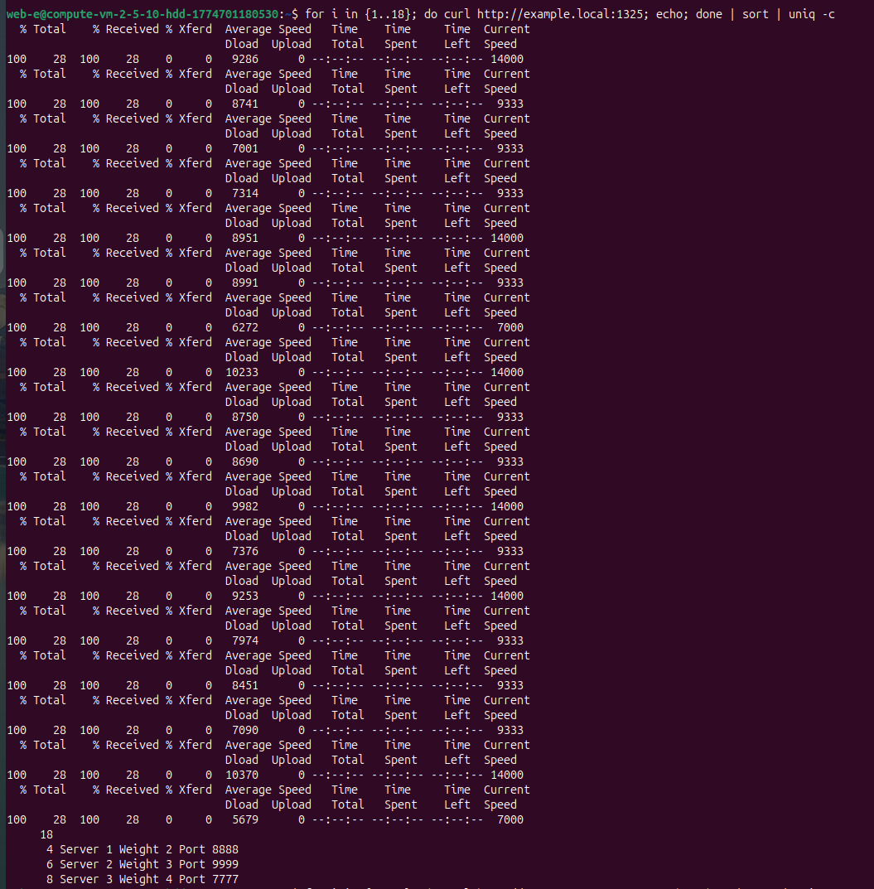
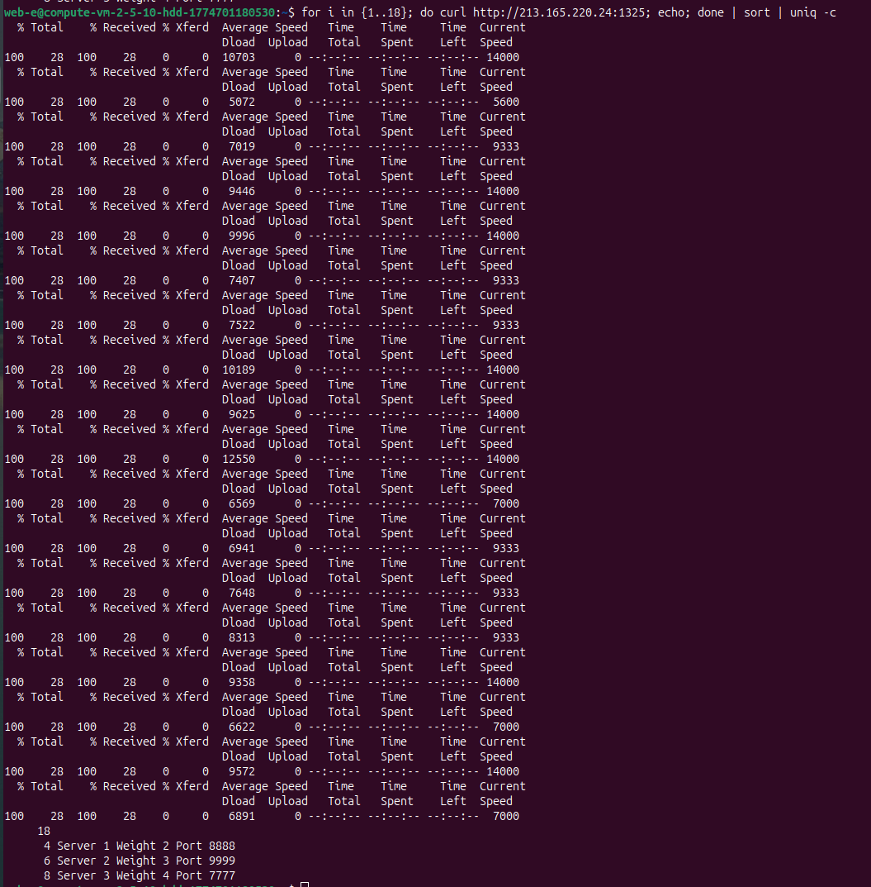
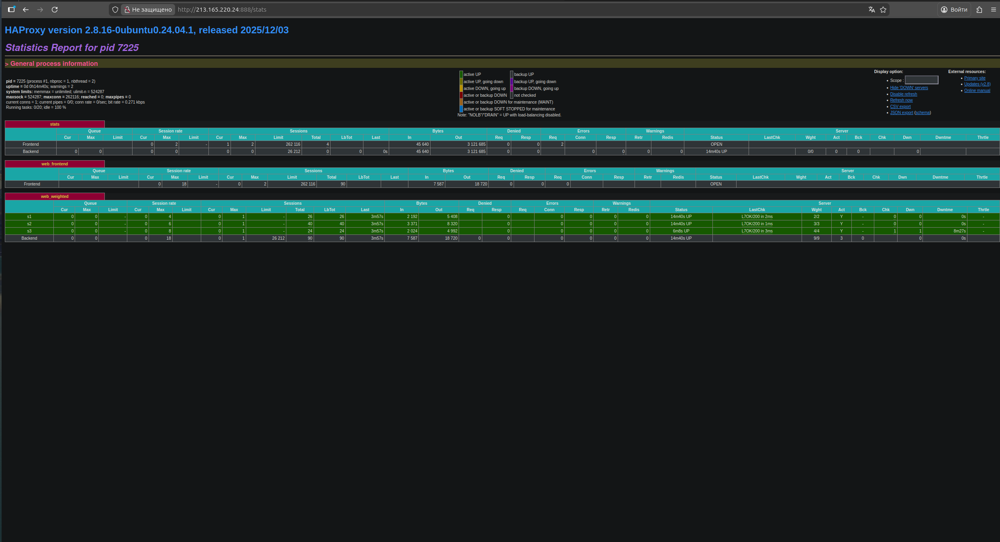

# Домашнее задание к занятию «Кластеризация и балансировка нагрузки»
**Выполнил:** Чехлов Михаил


## Задание 1


### Результат нескольких последовательных запросов к HAProxy


*Чередование ответов «Server 1 Port 8888» и «Server 2 Port 9999».*

## Задание 2

### Балансировка по домену example.local


*Статус раннера — active (зелёная точка), теги: `nginx`, `keepalived`.*

### Балансировка без домена (по IP)


*Статус раннера — active (зелёная точка), теги: `nginx`, `keepalived`.*

###  Веб‑интерфейс статистики HAProxy


*Статус раннера — active (зелёная точка), теги: `nginx`, `keepalived`.*

## Настройка HAProxy для L4‑балансировки (TCP)

Содержимое файла `/etc/haproxy/haproxy.cfg`:

```sh

global
    log /dev/log    local0
    log /dev/log    local1 notice
    chroot /var/lib/haproxy
    stats socket /run/haproxy/admin.sock mode 660 level admin expose-fd listeners
    stats timeout 30s
    user haproxy
    group haproxy
    daemon

    ca-base /etc/ssl/certs
    crt-base /etc/ssl/private

    ssl-default-bind-ciphers ECDHE-ECDSA-AES128-GCM-SHA256:ECDHE-RSA-AES128-GCM-SHA256:ECDHE-ECDSA-AES256-GCM-SHA384:ECDHE-RSA-AES256-GCM-SHA384:ECDHE-ECDSA-CHACHA20-POLY1305:ECDHE-RSA-CHACHA20-POLY1305:DHE-RSA-AES128-GCM-SHA256:DHE-RSA-AES256-GCM-SHA384
    ssl-default-bind-ciphersuites TLS_AES_128_GCM_SHA256:TLS_AES_256_GCM_SHA384:TLS_CHACHA20-POLY1305_SHA256
    ssl-default-bind-options ssl-min-ver TLSv1.2 no-tls-tickets

defaults
    log global
    mode tcp                # L4: TCP балансировка
    option tcplog
    option dontlognull
    timeout connect 5000ms
    timeout client  50000ms
    timeout server  50000ms

listen stats
    bind :888
    mode http
    stats enable
    stats uri /stats
    stats refresh 5s
    stats realm Haproxy\ Statistics

listen web_tcp
    bind :1325              # Порт, на котором HAProxy принимает запросы
    mode tcp               # Указываем режим TCP
    balance roundrobin     # Алгоритм балансировки
    server s1 213.165.214.212:8888 check inter 3s
    server s2 178.154.193.87:9999 check inter 3s

```
## Конфигурация HAProxy для Weighted Round Robin на L7

Содержимое файла `/etc/haproxy/haproxy.cfg`:

```sh
global
    log /dev/log    local0
    log /dev/log    local1 notice
    chroot /var/lib/haproxy
    stats socket /run/haproxy/admin.sock mode 660 level admin expose-fd listeners
    stats timeout 30s
    user haproxy
    group haproxy
    daemon

defaults
    log global
    mode http
    option httplog
    option dontlognull
    timeout connect 5000ms
    timeout client  50000ms
    timeout server  50000ms

listen stats
    bind :888
    mode http
    stats enable
    stats uri /stats
    stats refresh 5s
    stats realm Haproxy\ Statistics

frontend web_frontend
    bind :1325
    mode http
    acl is_example_local hdr(host) -i example.local
    use_backend web_weighted if is_example_local
    default_backend web_weighted  # для демонстрации без домена

backend web_weighted
    mode http
    balance roundrobin
    option httpchk
    http-check send meth GET uri /
    http-check expect status 200
    server s1 213.165.214.212:8888 weight 2 check inter 3s
    server s2 178.154.193.87:9999 weight 3 check inter 3s
    server s3 213.165.213.89:7777 weight 4 check inter 3s
