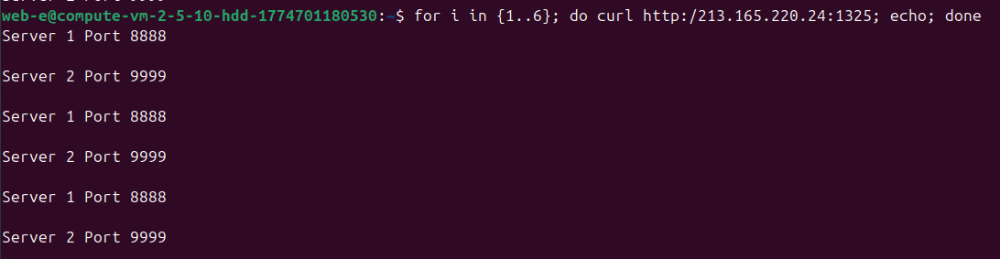
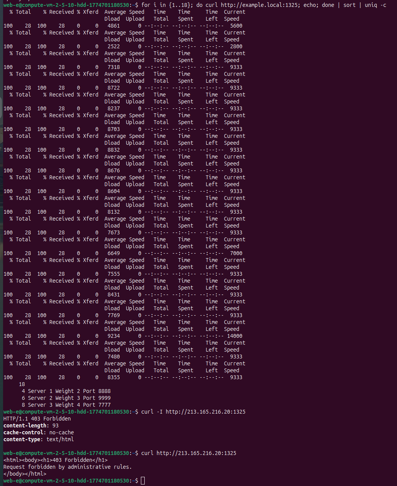

# Домашнее задание к занятию «Кластеризация и балансировка нагрузки»
**Выполнил:** Чехлов Михаил

## Задание 1

## [Конфигурация HAProxy (haproxy.cfg)](haproxy.cfg)

### Результат нескольких последовательных запросов к HAProxy

*Чередование ответов «Server 1 Port 8888» и «Server 2 Port 9999».*

## Задание 2

## [Конфигурация HAProxy для Weighted Round Robin на L7](haproxy_.cfg)

### Балансировка по домену example.local и балансировка без домена (по IP)

*Балансировка по домену (curl 18 раз + sort | uniq -c, распределение 4:6:8).*
*Балансировка по IP (curl по IP + sort | uniq -c).*

